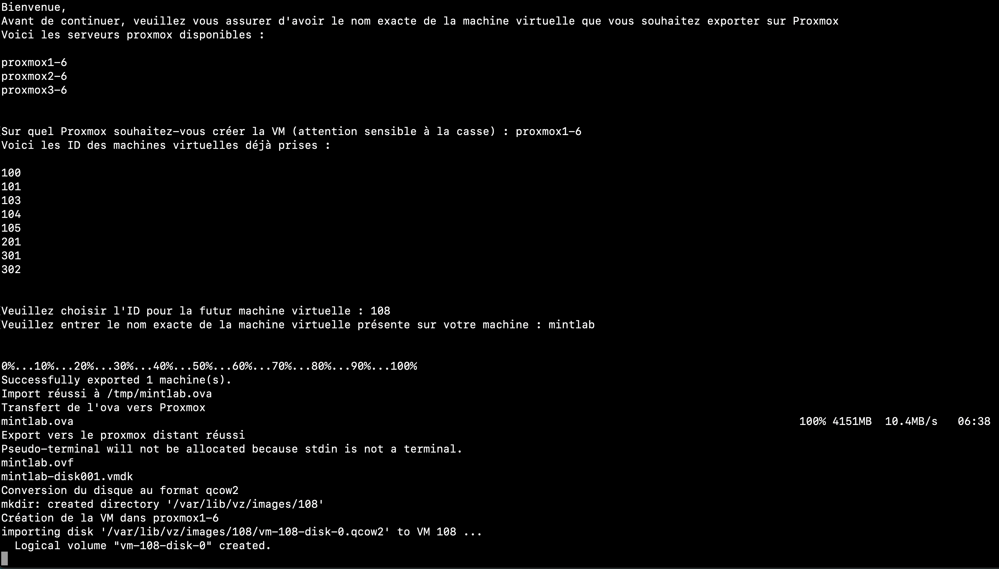
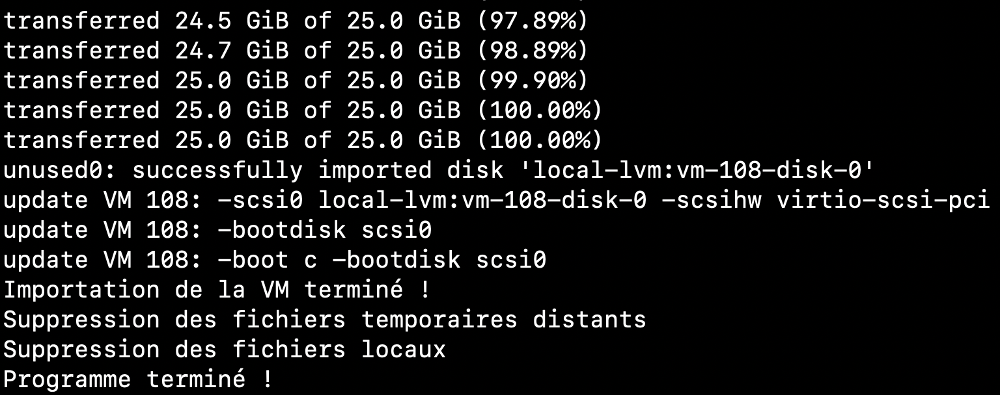

# Repository for a Proxmox Script

- This script is a student project where we had to export an ova file from `VirtualBox` then pushed it to a Proxmox Server and installing it.
- Download the repository `git clone https://github.com/P1nguNix/proxmox_import_ova.git`

---

# Usage

- In the first lines of the script, you have to fit the environment variables to your liking.
- The variables are PROXMOX_USER, PROXMOX_HOST and REMOTE_STORAGE_NAME.

---

# Output

The followings output are what your future usage of this script should look like.

  Enjoy !
